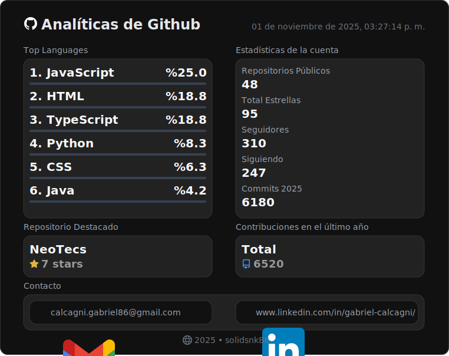

### ¿Te gusta el badge contador de visitas?

- Te explico como usarlo en tu perfil por <a href="https://github.com/solidsnk86/solidsnk86/blob/master/BADGE-INSTRUCTIONS.md">acá...</a>

## 👨‍💻 Sobre mí

**Desarrollador Front End con conocimientos en Back End**

🎓 Estudiando Tecnicatura Universitaria en Programación  
🏫 UTN Facultad Regional de San Rafael (Mendoza)

<h3>Frases random</h3>

> *"Haz lo que puedas, con lo que tengas, donde estés."*
>
> — Theodore Roosevelt

#

 

 

## 📡 App para detectar tu antena WiFi más próxima en varias provincias de Argentina y otros lugares de Europa.

Esta app te ayuda a detectar cuales son los tres puntos de conexión WiFi gratis más cercanos que hay a tu disposición.
También en la misma web está disponible una aplicación de PC escritorio que automatiza las configuraciones inalámbricas
de los modelos CPE de Tp-Link con sistema Pharos, ideal para la red WiFi gratuita de la provincia de San Luis.
`NeoWiFi App 1.3.6-betav-beta`:
visita este link si te es de ayuda: <a href="https://neo-wifi.vercel.app/">https://neo-wifi.vercel.app</a>

 

## 💼 Mi Portafolio

Podés dar un vistazo al sitio acá 👉: [https://calcagni-gabriel-dev.vercel.app](https://calcagni-gabriel-dev.vercel.app)

## 📫 Conecta conmigo

 

## 📊 Estadísticas de GitHub

📈 Los datos se obtienen mediante la `API v3` y `GraphQL API` de GitHub. Gracias a `Node.js` y los flujos de trabajo automatizados de `Github Actions`
; las estadísticas se actualizan cada dos horas.

## No me siguen de nuevo: 4

  

  

  

  

